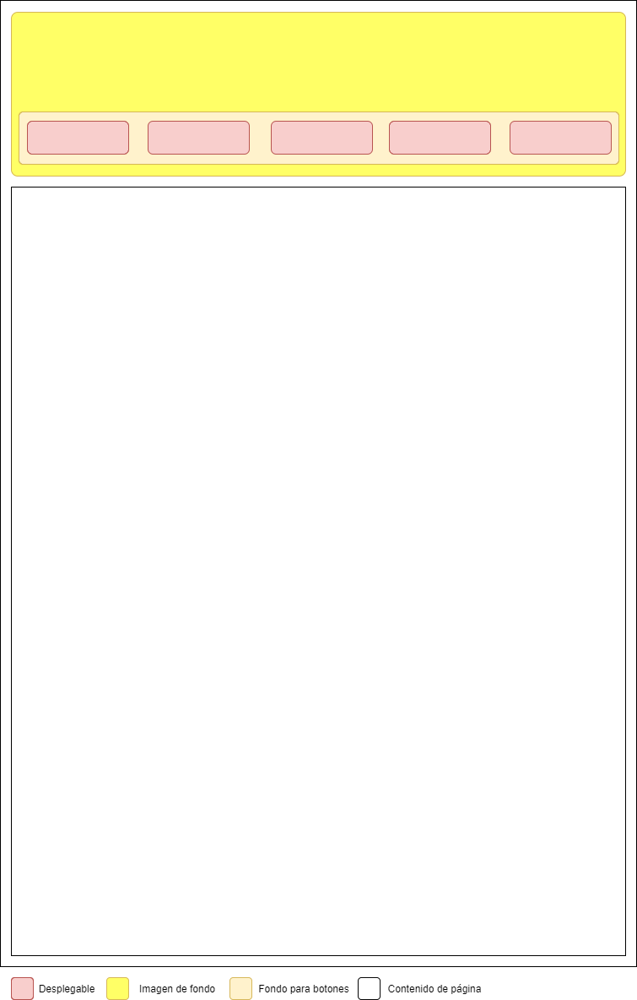
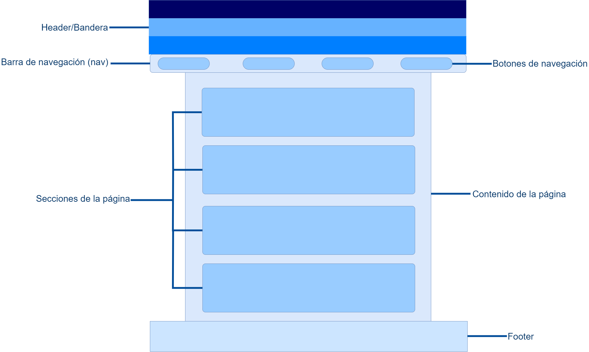
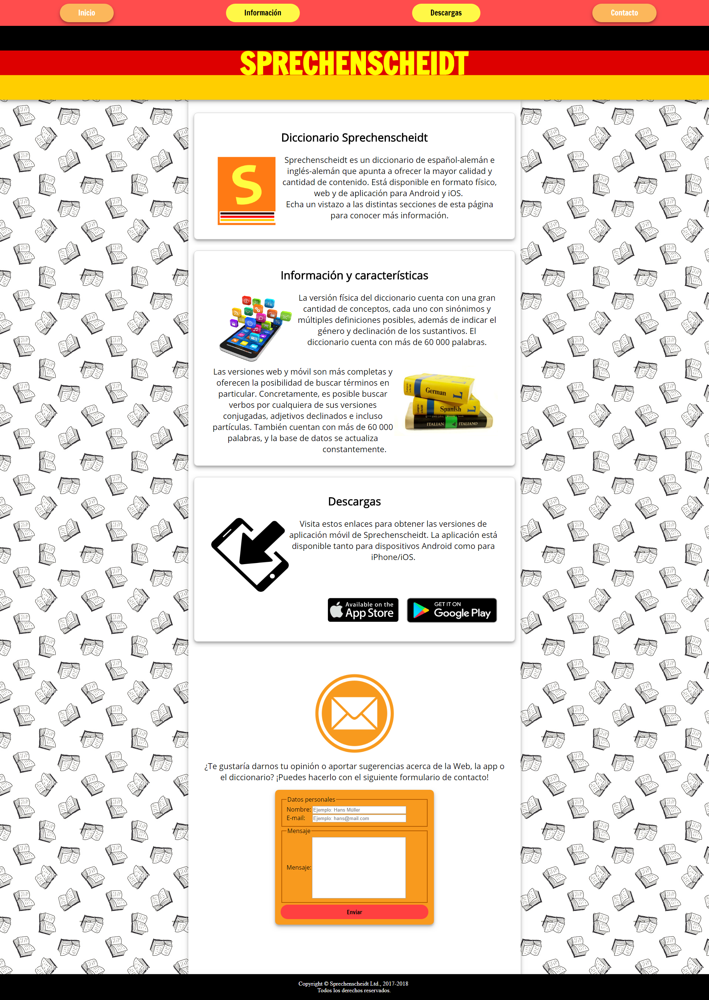

# Proyecto Sprechenscheidt

## Descripción del proyecto
Proyecto de página web de información, chuletas y enlaces de alemán. También se presentará y promocionará un diccionario de alemán-español y una app relacionada a este.

## Enlaces a perfiles
| Descripción | Enlaces | Observaciones |
|-------------|---------|---------------|
| CodePen | [https://codepen.io/Lesen7/](https://codepen.io/Lesen7/) | Mi perfil de CodePen |
| GitHub | [https://lesen7.github.io/sprechenscheidt/](https://lesen7.github.io/sprechenscheidt/) | Página principal del proyecto |

## Herramientas utilizadas
* Draw.io: [https://www.draw.io/](https://www.draw.io/)
* Trello: [https://trello.com/](https://trello.com/)
* Atom: [https://atom.io/](https://atom.io/)
  * Plugins: linter, linter-ui-default, linter-tidy, busy-signal, intentions, linter-slint, atom-beautify, color-picker, emmet, minimap.
* Inkscape: [https://inkscape.org/es/](https://inkscape.org/es/)
* Real Favicon Generator: [https://realfavicongenerator.net/](https://realfavicongenerator.net/)
* Librerías JS: [https://leocs.me/menuspy/](https://leocs.me/menuspy/) Menuspy (menú/header fijo)
* Librerías CSS: [http://unicorn-ui.com/buttons/](http://unicorn-ui.com/buttons/) unicorn-ui (botones)
* Formspree: [https://formspree.io/](https://formspree.io/) formulario de contacto simple

## Progreso
### Fase 1:
* Boceto del diseño inicial:

### Fase 2:
* Boceto de la fase 2:

* Añadido fondo de dibujo en patrón sin bordes. Se han añadido sombras suaves a los elementos de la página que se quiere que resalten sobre el fondo.
* Se ha añadido la librería unicorn-ui para facilitar la creación de botones.
* Se han añadido imágenes pequeñas en línea con los textos para que resulten más llamativos.

### Fase 3:
* Boceto de la fase 3:

* Se ha diseñado y añadido un favicon con Inkscape y Real Favicon Generator.
* Se ha añadido un formulario de contacto básico.
* Se ha añadido la librería menuspy para que el nav de la página siga al usuario a medida que vaya haciendo scroll.
* Se ha modificado manualmente el código de la librería unicorn-ui para añadir una nueva clase de botón, principalmente para el formulario.

## Tareas pendientes
* Añadir diseño responsive.

## Captura de pantalla de la página

